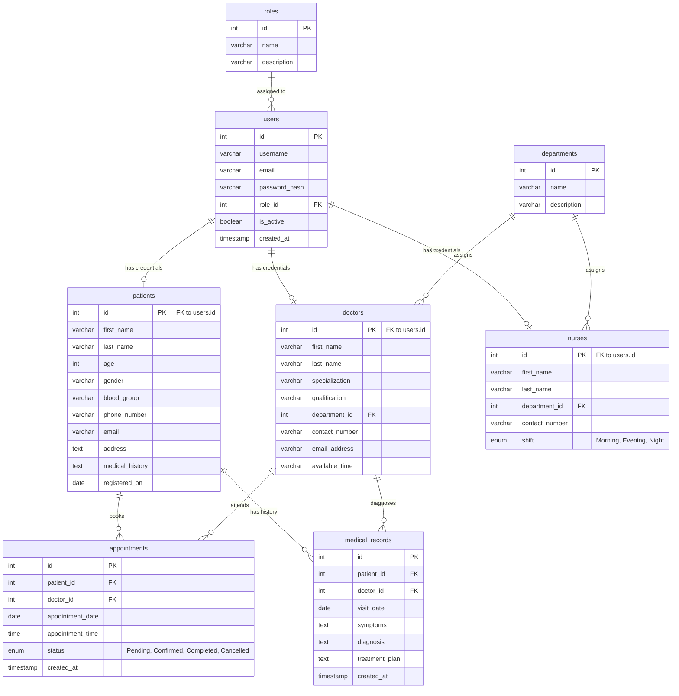

# Database Documentation — IPCMS Schema & ERD

This document contains the complete database schema specification, table structures, index strategies, foreign key constraints, and relational patterns for the **Integrated Patient Care Management System (IPCMS)**.

---

## 1. Entity Relationship Diagram (ERD)

---

## 2. Table Specifications

### 2.1 Table: `roles`
Stores authorization groups.
- `id`: INT (Primary Key, Auto Increment)
- `name`: VARCHAR(50) (Unique, Not Null) — e.g. `'Admin'`, `'Doctor'`, `'Nurse'`, `'Patient'`
- `description`: VARCHAR(255) (Null)

### 2.2 Table: `users`
Contains the core login credentials.
- `id`: INT (Primary Key, Auto Increment)
- `username`: VARCHAR(50) (Unique, Not Null)
- `email`: VARCHAR(100) (Unique, Not Null)
- `password_hash`: VARCHAR(255) (Not Null)
- `role_id`: INT (Foreign Key referencing `roles.id`, ON DELETE RESTRICT, ON UPDATE CASCADE)
- `is_active`: BOOLEAN (Default TRUE, Not Null) — used for soft deletes
- `created_at`: TIMESTAMP (Default CURRENT_TIMESTAMP)

### 2.3 Table: `patients`
Stores patient-specific demographics.
- `id`: INT (Primary Key, Foreign Key referencing `users.id`, ON DELETE CASCADE, ON UPDATE CASCADE)
- `first_name`: VARCHAR(50) (Not Null)
- `last_name`: VARCHAR(50) (Not Null)
- `age`: INT (Not Null)
- `gender`: VARCHAR(20) (Not Null)
- `blood_group`: VARCHAR(10) (Not Null)
- `phone_number`: VARCHAR(20) (Not Null)
- `email`: VARCHAR(100) (Not Null)
- `address`: TEXT (Not Null)
- `medical_history`: TEXT (Null)
- `registered_on`: DATE (Not Null)

### 2.4 Table: `doctors`
Stores doctor clinical specializations.
- `id`: INT (Primary Key, Foreign Key referencing `users.id`, ON DELETE CASCADE, ON UPDATE CASCADE)
- `first_name`: VARCHAR(50) (Not Null)
- `last_name`: VARCHAR(50) (Not Null)
- `specialization`: VARCHAR(100) (Not Null)
- `qualification`: VARCHAR(100) (Not Null)
- `department_id`: INT (Foreign Key referencing `departments.id`, ON DELETE RESTRICT, ON UPDATE CASCADE)
- `contact_number`: VARCHAR(20) (Not Null)
- `email_address`: VARCHAR(100) (Not Null)
- `available_time`: VARCHAR(100) (Not Null)

### 2.5 Table: `nurses`
Stores nursing staff rosters.
- `id`: INT (Primary Key, Foreign Key referencing `users.id`, ON DELETE CASCADE, ON UPDATE CASCADE)
- `first_name`: VARCHAR(50) (Not Null)
- `last_name`: VARCHAR(50) (Not Null)
- `department_id`: INT (Foreign Key referencing `departments.id`, ON DELETE RESTRICT, ON UPDATE CASCADE)
- `contact_number`: VARCHAR(20) (Not Null)
- `shift`: ENUM('Morning', 'Evening', 'Night') (Not Null, Default 'Morning')

### 2.6 Table: `departments`
Groups clinical offices.
- `id`: INT (Primary Key, Auto Increment)
- `name`: VARCHAR(100) (Unique, Not Null) — e.g. `'Cardiology'`, `'General Medicine'`
- `description`: TEXT (Null)

### 2.7 Table: `appointments`
Details consultations bookings.
- `id`: INT (Primary Key, Auto Increment)
- `patient_id`: INT (Foreign Key referencing `patients.id`, ON DELETE CASCADE, ON UPDATE CASCADE)
- `doctor_id`: INT (Foreign Key referencing `doctors.id`, ON DELETE CASCADE, ON UPDATE CASCADE)
- `appointment_date`: DATE (Not Null)
- `appointment_time`: TIME (Not Null)
- `status`: ENUM('Pending', 'Confirmed', 'Completed', 'Cancelled') (Not Null, Default 'Pending')
- `created_at`: TIMESTAMP (Default CURRENT_TIMESTAMP)

### 2.8 Table: `medical_records`
Stores personal clinical history details.
- `id`: INT (Primary Key, Auto Increment)
- `patient_id`: INT (Foreign Key referencing `patients.id`, ON DELETE CASCADE, ON UPDATE CASCADE)
- `doctor_id`: INT (Foreign Key referencing `doctors.id`, ON DELETE CASCADE, ON UPDATE CASCADE)
- `visit_date`: DATE (Not Null)
- `symptoms`: TEXT (Not Null)
- `diagnosis`: TEXT (Not Null)
- `treatment_plan`: TEXT (Null)
- `created_at`: TIMESTAMP (Default CURRENT_TIMESTAMP)

---

## 3. Indexes & Constraints

To optimize search queries and directory views, the following index strategies are applied:
1. **Unique Index** on `users.email` and `users.username` for O(1) credentials verification during login and signup.
2. **Shared Primary Key Relations** (One-to-One FKs on `patients.id`, `doctors.id`, and `nurses.id`) ensure that demographics cannot exist without corresponding login accounts, avoiding orphan records.
3. **Compound Search Indexes** (internally handled by MySQL query optimizer on FK columns) optimize joins during list loads.
