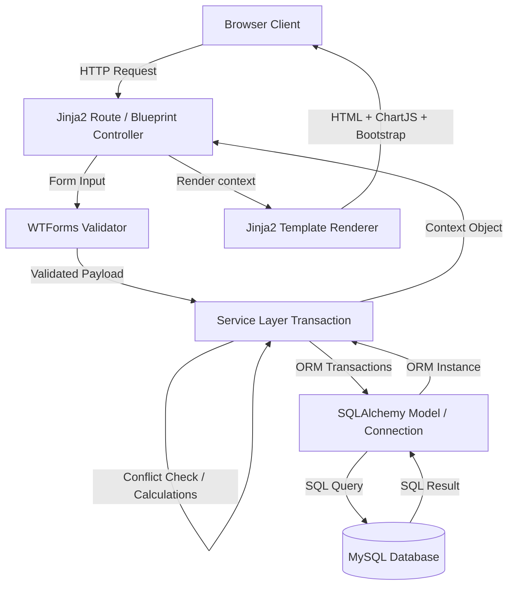

# Project Structure Documentation — IPCMS

This document provides a detailed overview of the folder structure, execution flow, design patterns, and file descriptions for the **Integrated Patient Care Management System (IPCMS)**.

---

## 1. Directory Tree

```text
Integrated_Patient_Care/
│
├── database/                   # Database engine connection pool
│   ├── __init__.py
│   └── connection.py           # SQLAlchemy database instance provider
│
├── forms/                      # WTForms input validators
│   ├── __init__.py
│   ├── appointment_form.py     # Booking validations
│   ├── doctor_form.py          # Clinic details validations
│   ├── nurse_form.py           # Shift & Department validation
│   └── patient_form.py         # Demographics validation
│
├── models/                     # SQLAlchemy declarative model schemas
│   ├── __init__.py
│   ├── appointment.py          # Table: appointments
│   ├── department.py           # Table: departments
│   ├── doctor.py               # Table: doctors
│   ├── medical_record.py       # Table: medical_records
│   ├── nurse.py                # Table: nurses
│   ├── password_reset_token.py # Table: password_reset_tokens
│   ├── patient.py              # Table: patients
│   ├── role.py                 # Table: roles
│   └── user.py                 # Table: users (core credentials)
│
├── routes/                     # Blueprint controllers
│   ├── __init__.py
│   ├── admin.py                # Admin actions & analytics
│   ├── appointment.py          # Scheduling, rescheduling & cancel
│   ├── auth.py                 # Login, signup & session handlers
│   ├── dashboard.py            # Central dispatcher
│   ├── doctor.py               # Doctor CRUD & directories
│   ├── nurse.py                # Nurse CRUD & dashboard
│   └── patient.py              # Patient CRUD & dashboards
│
├── services/                   # Business transaction layers
│   ├── __init__.py
│   ├── appointment_service.py  # Conflict detection & timing validation
│   ├── doctor_service.py       # Sync doctor credentials CRUD
│   ├── nurse_service.py        # Sync nurse credentials CRUD
│   └── patient_service.py      # Sync patient credentials CRUD
│
├── static/                     # Web assets
│   ├── css/
│   │   └── styles.css          # Glassmorphism & custom colors theme
│   └── js/
│       └── main.js             # Client micro-interactions
│
├── templates/                  # Jinja2 HTML layout views
│   ├── dashboards/
│   │   ├── admin.html          # Stats grids & ChartJS canvases
│   │   ├── doctor.html         # Backlog & agenda
│   │   ├── nurse.html          # Active patient roster
│   │   └── patient.html        # Medical records & logs
│   │
│   ├── patients/               # Patient templates
│   ├── doctors/                # Doctor templates
│   ├── nurses/                 # Nurse templates
│   ├── appointments/           # Appointment templates
│   ├── base.html               # Main navbar & shell structure
│   └── login.html              # Authentication entry
│
├── .env                        # Connection credentials (ignored in VCS)
├── .env.example                # Sample environment variables
├── app.py                      # Application bootstrap factory
├── config.py                   # Development, testing, & production configs
├── requirements.txt            # System dependencies manifest
├── setup_database.py           # DDL compiler & default seed engine
└── wsgi.py                     # Production gateway interface
```

---

## 2. Core Components & Execution Flow

The system uses a classic **Controller-Service-Repository** pattern built on top of the Flask blueprint architecture:



1. **Routing and Presentation (Jinja2 Templates & Blueprints):**
   HTTP requests hit the controllers defined inside `routes/`. The controller instantiates WTForms (`forms/`) to handle raw POST payloads.
2. **Business & Transaction Logic (Service Layer):**
   Controllers delegate data manipulation to `services/`. The service layer is responsible for running checks (e.g., verifying if a patient already has an appointment at a chosen time, or validating that the appointment time falls within a doctor's active hours) and synchronizing multiple transactions (e.g., creating a `User` record first, hashing passwords, flushing to get the primary key, and then saving the profile).
3. **Data Access (SQLAlchemy Models):**
   The service layer leverages ORM classes inside `models/` to execute queries against MySQL, making the codebase clean, readable, and free of raw SQL queries.

---

## 3. Key Design Patterns

- **Application Factory Pattern (`app.py`):**
  Ensures configurations (e.g. testing, development) are dynamically bound at startup and makes unit testing simple by avoiding global mutable app instances.
- **Service Layer Pattern (`services/`):**
  Decouples the database schema and Flask session logic from the web routes, creating a highly testable framework.
- **Single-Table Inheritance Alternative (One-to-One Shared PKs):**
  Maintains separate database tables for `patients`, `doctors`, and `nurses` to prevent wide tables containing null values, while referencing `users.id` directly as their own primary key.
- **Soft Delete Pattern:**
  Instead of hard-deleting profiles (which would break clinical history constraints), the system disables the linked `User` record (`is_active = False`).
